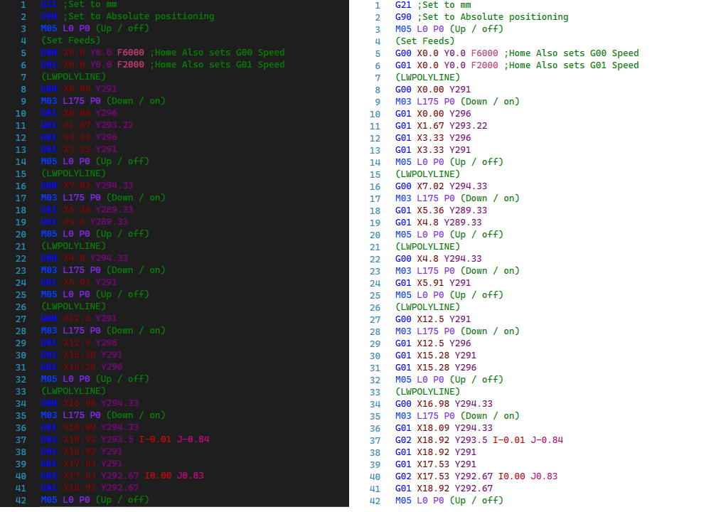

# G-Code Language Extension



## Installation - Visual Studio Market Place

https://marketplace.visualstudio.com/items?itemName=gojimmypi.gojimmypi-gcode-language-extension

## Installation - Manual install with source code 

Find the location of your `VSIXInstaller.exe`, typpically in `.\Common7\IDE\` of Developer Command Prompt. Shown is an example of VS2017 Enterprise:

```
c:
cd \workspace
git clone https://github.com/gojimmypi/GcodeLanguageExtension.git
cd GcodeLanguageExtension
msbuild GcodeLanguage.csproj
"C:\Program Files (x86)\Microsoft Visual Studio\2017\Enterprise\Common7\IDE\VSIXInstaller.exe"  C:\workspace\GcodeLanguageExtension\bin\Release\GcodeLanguage.vsix
```

For VS 2015:

```
"C:\Program Files (x86)\Microsoft Visual Studio 14.0\Common7\IDE\VSIXInstaller.exe"  C:\workspace\GcodeLanguageExtension\bin\Release\GcodeLanguage.vsix
```

## Removal

```
"C:\Program Files (x86)\Microsoft Visual Studio\2017\Enterprise\Common7\IDE\VSIXInstaller.exe" /uninstall:TBD TODO
```

## Testing

Open the project and press `F5` to launch an experimental versional of Visual Studio.

## Modifications

## Tips

Ensure the `CopyLocal` is set to `false` for all project references.

# Notes

[ – minimum version inclusive.

] – maximum version inclusive. 

( – minimum version exclusive. 

) – maximum version exclusive.


TODO

## Case Sensitivity
There seems to be a disagreement between various sources as to whether G-Code is case senstiive. According to  RS274/NGC Interpreter - Version 3, page 23:

"Input is case insensitive, except in comments, i.e., any letter outside a comment may be in upper
or lower case without changing the meaning of a line."

## Resources
* [Microsoft - Visual Studio Extensibility: Creating Visual Studio VSIX package extension](https://social.technet.microsoft.com/wiki/contents/articles/37071.visual-studio-extensibility-creating-visual-studio-vsix-package-extension.aspx)
* [Microsoft - Walkthrough: Publish a Visual Studio extension](https://docs.microsoft.com/en-us/visualstudio/extensibility/walkthrough-publishing-a-visual-studio-extension?view=vs-2019)
* [Microsoft - Walkthrough: Displaying Statement Completion](https://docs.microsoft.com/en-us/visualstudio/extensibility/walkthrough-displaying-statement-completion)
* [Microsoft - Colors and Styling for Visual Studio](https://docs.microsoft.com/en-us/visualstudio/extensibility/ux-guidelines/colors-and-styling-for-visual-studio?view=vs-2019)

Looking at:
* [Microsoft - Walkthrough: Customize the text view](https://docs.microsoft.com/en-us/visualstudio/extensibility/walkthrough-customizing-the-text-view?view=vs-2019)
* [VSIX: How to get Colors in an Editor Extension](https://social.msdn.microsoft.com/Forums/vstudio/en-US/19a2c13d-86ac-4713-9897-88cc585201f1/vsix-how-to-get-colors-in-an-editor-extension?forum=vsx)

* [Extensibility tools written by Mads Kristensen](https://marketplace.visualstudio.com/items?itemName=MadsKristensen.ExtensibilityTools)
* [GitHub - Extensibility Tools for Visual Studio](https://github.com/madskristensen/ExtensibilityTools)
* [C# Color Table](http://flounder.com/csharp_color_table.htm)
* [The NIST RS274NGC Interpreter - Version 3](https://ws680.nist.gov/publication/get_pdf.cfm?pub_id=823374)
* [wikipedia - G-Codes](https://en.wikipedia.org/wiki/G-code)
* [linuxcnc - G-Code Quick Reference](http://linuxcnc.org/docs/html/gcode.html)
* [linuxcnc - M-Codes](http://linuxcnc.org/docs/html/gcode/m-code.html#mcode:m2-m30)
* [linuxcnc - G-Codes](http://linuxcnc.org/docs/html/gcode/overview.html)
* [linuxcnc - O-Codes](http://linuxcnc.org/docs/html/gcode/o-code.html)

## Other Stuff
* [Adding limit swtiches](http://blog.shahada.abubakar.net/post/adding-end-stops-limit-switches-to-the-3018-woodpecker-cnc-router)